# Motor de Scoring Distribuido — README General del Proyecto

**Versión funcional documentada:** V3.6.8.1  
**Nombre funcional:** Motor de Scoring / FinanScore  
**Objetivo:** transformar un motor de scoring originalmente monolítico en una arquitectura distribuida, segura, observable, resiliente y preparada para crecimiento.

---

## Tabla de contenido

1. [Resumen](#1-resumen)
2. [Objetivos de arquitectura](#2-objetivos-de-arquitectura)
3. [Arquitectura general](#3-arquitectura-general)
4. [Microservicios](#4-microservicios)
5. [Módulos compartidos](#5-módulos-compartidos)
6. [Tecnologías y versiones](#6-tecnologías-y-versiones)
7. [Patrones de software y distribuidos](#7-patrones-de-software-y-distribuidos)
8. [Flujo funcional](#8-flujo-funcional)
9. [Apache Kafka](#9-apache-kafka)
10. [Seguridad](#10-seguridad)
11. [Kong API Gateway](#11-kong-api-gateway)
12. [Spring Security y JWT](#12-spring-security-y-jwt)
13. [gRPC + mTLS + OAuth2](#13-grpc--mtls--oauth2)
14. [HashiCorp Vault](#14-hashicorp-vault)
15. [PostgreSQL y Database per Service](#15-postgresql-y-database-per-service)
16. [CQRS + Query Service + Redis](#16-cqrs--query-service--redis)
17. [MinIO](#17-minio)
18. [Observabilidad](#18-observabilidad)
19. [Resiliencia](#19-resiliencia)
20. [Frontend Angular](#20-frontend-angular)
21. [Auditoría y DLT](#21-auditoría-y-dlt)
22. [Schema Registry](#22-schema-registry)
23. [Configuración local](#23-configuración-local)
24. [Certificados de desarrollo](#24-certificados-de-desarrollo)
25. [Levantar el proyecto](#25-levantar-el-proyecto)
26. [Verificar el stack](#26-verificar-el-stack)
27. [URLs principales](#27-urls-principales)
28. [Pruebas rápidas](#28-pruebas-rápidas)
29. [Detener y volver a iniciar sin perder datos](#29-detener-y-volver-a-iniciar-sin-perder-datos)
30. [Logs y diagnóstico](#30-logs-y-diagnóstico)
31. [Estructura del repositorio](#31-estructura-del-repositorio)
32. [Pruebas recomendadas](#32-pruebas-recomendadas)
33. [Consideraciones para producción](#33-consideraciones-para-producción)
34. [Resumen rápido de comandos](#34-resumen-rápido-de-comandos)

---

# 1. Resumen

El proyecto implementa una **arquitectura distribuida basada en microservicios y eventos**.

El flujo principal de negocio se coordina mediante **Apache Kafka**, usando una **Saga por coreografía**. Cada microservicio posee su propia base de datos y no consulta directamente las bases de otros servicios.

Los componentes principales son:

```text
Angular
   |
   | HTTPS + JWT
   v
Kong API Gateway
   |
   +---------------------------------------------------------+
   |              |              |             |             |
   v              v              v             v             v
 IAM           Credit         Payment        Query         Report
   |
   | gRPC + mTLS + OAuth2
   |
Notification

                  APACHE KAFKA
       ==================================
       Credit → Payment → Scoring → Report
                         → Notification
       ==================================

Infraestructura:
PostgreSQL · Redis · MinIO · Vault · Schema Registry

Observabilidad:
Prometheus · Grafana · Loki · Tempo · OpenTelemetry · Alloy
```

Kafka es la columna vertebral asíncrona.  
gRPC se reserva para llamadas síncronas puntuales.

---

# 2. Objetivos de arquitectura

La solución busca:

- desacoplar los módulos del antiguo monolito;
- permitir despliegue independiente de servicios;
- soportar mayor concurrencia;
- continuar procesos aunque el usuario cierre la pantalla;
- evitar transacciones distribuidas 2PC;
- mantener consistencia eventual;
- proteger las comunicaciones;
- administrar secretos de manera centralizada;
- observar métricas, logs y trazas;
- tolerar duplicados, reintentos y fallos parciales;
- preparar la aplicación para crecer más allá de una instalación local.

Frase de referencia:

> Transformar dependencias locales del monolito en contratos distribuidos confiables, seguros, resilientes, observables y con datos autónomos.

---

# 3. Arquitectura general

La solución combina:

```text
Arquitectura distribuida
        +
Microservicios
        +
Event Driven Architecture
        +
Clean / Hexagonal Architecture
        +
CQRS
        +
Saga por coreografía
```

Principios principales:

```text
Database per Service
No Foreign Keys entre servicios
No SELECT directo a la BD de otro servicio
Consistencia eventual
Transactional Outbox
Idempotent Consumer
Kafka at-least-once
Retries + DLT
Contratos explícitos
JWT
TLS
Vault
Observabilidad distribuida
```

---

# 4. Microservicios

## IAM Service

Responsabilidad:

- usuarios;
- login local;
- MFA/TOTP;
- Google OAuth2/OIDC;
- soporte TikTok OAuth2;
- JWT;
- roles y permisos;
- OAuth2 Client Credentials interno;
- directorio de usuarios vía gRPC.

Puertos internos:

```text
HTTPS interno: 8081
gRPC:           9091
```

Base de datos:

```text
iam_db
```

---

## Credit Service

Responsabilidad:

- crear solicitudes crediticias;
- mantener estado inicial;
- validar propiedad de la solicitud;
- reaccionar a pagos;
- iniciar evaluación de scoring.

Puerto:

```text
8082
```

Base:

```text
credit_db
```

---

## Payment Service

Responsabilidad:

- pago simulado;
- Idempotency-Key;
- validación de tarjeta ficticia;
- monedas PEN, USD, EUR, CNY;
- tasas demo;
- publicación de PaymentValidated / PaymentRejected.

Puerto:

```text
8083
```

Base:

```text
payment_db
```

---

## Scoring Service

Responsabilidad:

- ejecutar las reglas de scoring;
- mantener dominio de scoring aislado de frameworks;
- obtener información financiera mediante `CreditDataProviderPort`;
- usar `SimulatedCreditBureauAdapter` en la demo;
- publicar `ScoringCalculated`.

Puerto:

```text
8084
```

Base:

```text
scoring_db
```

---

## Report Service

Responsabilidad:

- consumir resultado de scoring;
- generar PDF;
- almacenar el PDF en MinIO;
- publicar `ReportGenerated` con referencia y metadata.

Puerto:

```text
8085
```

Base:

```text
report_db
```

---

## Notification Service

Responsabilidad:

- consumir `ReportGenerated`;
- obtener datos de usuario desde IAM;
- enviar email/notificación;
- publicar `NotificationSent`.

Comunicación síncrona interna:

```text
Notification → IAM
gRPC + mTLS + OAuth2 Client Credentials
```

Puerto:

```text
8086
```

Base:

```text
notification_db
```

---

## Audit Service

Responsabilidad:

- consumir eventos de negocio y DLT;
- registrar evidencia funcional persistente;
- soportar panel administrativo de auditoría.

Puerto:

```text
8087
```

Base:

```text
audit_db
```

Auditoría y observabilidad son conceptos separados.

---

## Query Service

Responsabilidad:

- CQRS Read Side;
- construir proyecciones a partir de Kafka;
- soportar "Mis solicitudes";
- soportar consultas administrativas;
- usar Redis como cache-aside;
- continuar consultando PostgreSQL si Redis no está disponible.

Puerto:

```text
8088
```

Base:

```text
query_db
```

---

# 5. Módulos compartidos

## `contracts-java`

No es un microservicio.

Define contratos compartidos entre servicios.

Incluye conceptos como:

```text
EventEnvelope
EventTopics
Protobuf gRPC
```

Ejemplo conceptual:

```text
eventId
eventType
eventVersion
occurredAt
correlationId
causationId
traceId
source
aggregateId
payload
```

Su función es definir **qué se intercambia** entre microservicios.

---

## `distributed-support`

Tampoco es un microservicio.

Agrupa infraestructura técnica reutilizable:

```text
Transactional Outbox
Outbox Publisher
Idempotent Consumer
Retry / DLT
Observability Context
soporte distribuido común
```

Su función es definir **cómo implementar de forma reutilizable capacidades distribuidas**.

---

# 6. Tecnologías y versiones

## Backend

```text
Java                       21
Spring Boot                3.5.3
Spring Cloud               2025.0.0
Resilience4j               2.2.0
gRPC Java                  1.82.2
Protocol Buffers           3.25.9
MinIO Java SDK             8.5.17
OpenTelemetry Java Agent   2.18.1
Apache PDFBox              3.0.3
Maven
Spring Data JPA
Spring Security
OAuth2 Resource Server
Spring Cloud Vault
Spring Kafka
Spring Boot Actuator
Micrometer
Flyway
```

## Frontend

```text
Angular        20
TypeScript     5.8
RxJS           7.8
```

## Infraestructura

```text
PostgreSQL          17
Redis               7.4
Kong                3.9.3
Schema Registry     7.8.0
Vault               1.20
Prometheus          3.14.0
Grafana             13.2.2
Loki                3.7.8
Tempo               2.10.8
OTel Collector      0.161.0
Grafana Alloy       1.20.0
Redis Exporter      1.86.0
Docker
Docker Compose
MinIO Community     RELEASE.2025-09-07T16-13-09Z
Apache Kafka        imagen segura personalizada del proyecto
```

---

# 7. Patrones de software y distribuidos

## Clean / Hexagonal Architecture

Los servicios de negocio usan separación entre:

```text
Domain
Application
Ports
Adapters
Infrastructure
Presentation
```

Ejemplo Scoring:

```text
CreditDataProviderPort
        ↑
SimulatedCreditBureauAdapter
```

Esto permite reemplazar el proveedor demo por un buró real sin cambiar el dominio.

No todos los servicios necesitan el mismo nivel de complejidad: Query, Audit o Report aplican una variante más ligera porque son principalmente servicios técnicos/read-side.

---

## Transactional Outbox

Problema:

```text
Guardar en PostgreSQL
        +
Publicar a Kafka
```

no forman una única transacción distribuida.

Solución:

```text
Transacción local
    |
    +--> cambio de negocio
    |
    +--> evento Outbox PENDING

Outbox Publisher
    |
    v
Kafka
    |
    v
PUBLISHED
```

Evita perder un evento si Kafka falla después de persistir el estado de negocio.

---

## Idempotent Consumer

Kafka usa entrega **at-least-once**, por lo que un mensaje puede llegar más de una vez.

Cada consumidor registra eventos procesados:

```text
eventId + consumerName
```

Antes de aplicar el efecto:

```text
alreadyProcessed?
    |
   sí → ignorar
   no → procesar y registrar
```

---

## Saga por coreografía

No existe un Saga Orchestrator central.

Cada servicio:

```text
consume evento
     ↓
ejecuta su operación
     ↓
publica el siguiente evento
```

---

## CQRS

Command Side:

```text
Credit
Payment
Scoring
Report
Notification
```

Query Side:

```text
Query Service
query_db
Redis
```

Audit Side:

```text
Audit Service
audit_db
```

---

## Cache Aside

Query Service:

```text
Consulta
  ↓
Redis
  ├── HIT  → devolver cache
  └── MISS → PostgreSQL → guardar temporalmente en Redis
```

Redis no es la fuente de verdad.

---

## Circuit Breaker

Protege una dependencia que está fallando repetidamente.

Estados:

```text
CLOSED
OPEN
HALF_OPEN
```

Ejemplo:

```text
Notification → IAM gRPC
```

---

## Retry

Reintenta fallos temporales según configuración de Resilience4j.

---

## Bulkhead

Limita concurrencia para evitar que una dependencia lenta consuma todos los recursos.

Ejemplo Notification → IAM:

```text
@Bulkhead(name="iamDirectory", type=SEMAPHORE)
```

Configuración de demo:

```text
max-concurrent-calls: 10
max-wait-duration: 0
```

---

# 8. Flujo funcional

## Flujo principal

```text
1. Usuario crea solicitud
        ↓
CreditRequestCreated

2. Usuario confirma pago
        ↓
PaymentValidated

3. Credit cambia solicitud a SUBMITTED
        ↓
CreditEvaluationRequested

4. Scoring calcula riesgo
        ↓
ScoringCalculated

5. Report genera PDF y almacena en MinIO
        ↓
ReportGenerated

6. Notification obtiene correo de IAM y notifica
        ↓
NotificationSent

7. Query Service actualiza sus Read Models
        ↓
Mis solicitudes / Admin

8. Audit Service conserva evidencia funcional
```

---

# 9. Apache Kafka

Kafka es el backbone asíncrono del sistema.

## Seguridad Kafka

Se usa:

```text
TLS
+
SASL/SCRAM-SHA-512
+
ACL
```

Interpretación:

```text
TLS  → cifra y valida el broker
SASL → autentica al microservicio
ACL  → autoriza topics y consumer groups
```

Protocol:

```text
SASL_SSL
```

Kafka expone:

```text
kafka:29092       dentro de Docker
localhost:9092    desde el host
```

---

## Principales Kafka

Cada servicio usa una identidad distinta:

```text
iam-service
credit-service
payment-service
scoring-service
report-service
notification-service
audit-service
query-service
schema-registry
```

Las contraseñas Kafka se almacenan en Vault.

---

## Configuración Kafka

Archivos principales:

```text
platform/kafka/Dockerfile
platform/kafka/entrypoint.sh
platform/kafka/init-topics-acls.sh
```

`entrypoint.sh` configura:

```text
KRaft
TLS
SASL_SSL
SCRAM-SHA-512
StandardAuthorizer
superusuarios
credenciales
```

`init-topics-acls.sh` crea:

```text
topics
ACL de lectura
ACL de escritura
ACL de consumer groups
```

---

## Validación Kafka

```powershell
docker compose --env-file .env --env-file secrets/bootstrap.env logs -f kafka
```

Filtrado:

```powershell
docker compose --env-file .env --env-file secrets/bootstrap.env logs kafka | Select-String -Pattern "ERROR|WARN|SSL|SASL|SCRAM|ACL|authentication|authorization|Exception|Failed"
```

En entornos con shell disponible:

```text
scripts/verify-kafka-security.sh
```

---

# 10. Seguridad

La solución aplica defensa en profundidad.

```text
Navegador
   |
   | HTTPS
   v
Kong
   |
   | JWT + CORS + Rate Limit
   | HTTPS + verificación CA
   v
Microservicio
   |
   | Spring Security vuelve a validar JWT
   v
Aplicación
```

Adicionalmente:

```text
Kafka      → SASL_SSL + SCRAM + ACL
PostgreSQL → TLS verify-full
gRPC       → mTLS + OAuth2
Vault      → AppRole
MinIO      → credenciales desde Vault
```

---

# 11. Kong API Gateway

Kong es el punto de entrada externo a las APIs.

Configuración:

```text
gateway/kong/kong.yml
```

Puerto:

```text
https://localhost:8443
```

Admin API:

```text
http://localhost:8001
```

Funciones:

```text
Routing
TLS
JWT
CORS
Rate Limiting
verificación TLS de upstreams
```

---

## Rutas públicas

No exigen Access JWT:

```text
/api/v1/auth/**
/oauth2/**
/login/oauth2/**
```

---

## Rutas protegidas

Ejemplos:

```text
/api/v1/users/**
/api/v1/credit-requests/**
/api/v1/payments/**
/api/v1/reports/**
/api/v1/query/**
/api/v1/admin/**
```

---

## CORS

Kong acepta Angular local:

```text
Origin:
http://localhost:4200
```

Métodos:

```text
GET
POST
PUT
PATCH
DELETE
OPTIONS
```

Headers permitidos:

```text
Authorization
Content-Type
Idempotency-Key
X-Correlation-Id
```

---

## Rate Limit

Configuración global:

```text
120 solicitudes por minuto
```

Policy:

```text
local
```

Al exceder el límite:

```text
HTTP 429 Too Many Requests
```

---

## HTTPS interno

Kong se comunica mediante HTTPS con:

```text
IAM       https://iam-service:8081
Credit    https://credit-service:8082
Payment   https://payment-service:8083
Report    https://report-service:8085
Query     https://query-service:8088
Audit     https://audit-service:8087
```

Se usa:

```text
tls_verify: true
CA interna del proyecto
```

---

# 12. Spring Security y JWT

Kong valida el JWT en el perímetro, pero el microservicio vuelve a validarlo.

Esto es **defense in depth**.

Los servicios protegidos validan conceptos como:

```text
firma RSA
issuer
audience
exp
token_use
MFA
roles
permissions/scopes cuando corresponde
```

IAM firma tokens con RS256.

El usuario se autentica contra IAM; los otros microservicios no reciben contraseña del usuario.

---

## Login local

IAM busca:

```text
usuarios_app
credenciales_locales
```

La contraseña no se guarda en texto plano.

Se utiliza:

```text
Argon2
```

Flujo:

```text
email + password
     ↓
IAM
     ↓
PostgreSQL iam_db
     ↓
Argon2 matches()
     ↓
MFA
     ↓
JWT
```

---

# 13. gRPC + mTLS + OAuth2

gRPC **no** conecta todos los microservicios.

Se usa únicamente para llamadas síncronas puntuales.

Implementación principal:

```text
Notification Service
        |
        | 1. OAuth2 Client Credentials
        |    mediante Kong/IAM
        |
        | 2. gRPC + mTLS + Bearer JWT
        v
IAM Service
```

Notification necesita obtener datos del usuario para enviar notificaciones.

Seguridad:

```text
CA
certificado servidor IAM
certificado cliente Notification
ClientAuth.REQUIRE
OAuth2 Client Credentials
scope=iam.user.read
aud=iam-grpc
token_use=CLIENT_CREDENTIALS
CN certificado = sub JWT
```

Esto combina:

```text
mTLS  → identidad criptográfica del workload
OAuth2 → autorización de la operación
```

---

# 14. HashiCorp Vault

Vault funciona como Secret Manager.

Versión:

```text
HashiCorp Vault 1.20
```

En local corre en:

```text
http://localhost:8200
```

En esta versión de laboratorio se ejecuta en **dev mode**.

---

## Qué almacena Vault

Entre otros:

```text
DB_PASSWORD
KAFKA_PASSWORD
KAFKA_TRUSTSTORE_PASSWORD
REDIS_PASSWORD
MINIO_ROOT_PASSWORD
OAuth2 client secret
Gmail App Password
otros secretos por servicio
```

---

## AppRole

Cada microservicio tiene:

```text
RoleID
SecretID
policy propia
path KV propio
```

Ejemplo:

```text
secret/finanscore/report-service
```

Spring importa secretos mediante:

```yaml
spring:
  config:
    import: vault://
```

y:

```text
VAULT_ROLE_ID
VAULT_SECRET_ID
```

---

## Inicialización

Archivo:

```text
platform/vault/init-vault.sh
```

Responsabilidades:

```text
habilitar KV v2
crear secretos
crear policies
configurar AppRole
cargar secretos por servicio
```

El root token de Vault no se entrega a los microservicios.

---

## Validar Vault

```powershell
curl.exe http://localhost:8200/v1/sys/health
```

También existe:

```text
scripts/verify-vault.sh
```

---

# 15. PostgreSQL y Database per Service

Se usa PostgreSQL 17.

Una instancia PostgreSQL contiene bases lógicas separadas:

```text
iam_db            / iam_user
credit_db         / credit_user
payment_db        / payment_user
scoring_db        / scoring_user
report_db         / report_user
notification_db   / notification_user
audit_db          / audit_user
query_db          / query_user
```

No existen claves foráneas entre bases de diferentes microservicios.

No se permiten consultas directas de un servicio a la BD de otro.

---

## TLS PostgreSQL

PostgreSQL exige TLS en TCP.

Los servicios usan:

```text
sslmode=verify-full
```

y la CA del proyecto.

Validación:

```powershell
.\scripts\verify-postgres-tls.ps1
```

Resultado esperado:

```text
ssl=on
TLSv1.3
verify-full correcto
conexión sin SSL rechazada
```

---

## DBeaver

Configuración típica:

```text
Host: localhost
Port: 5432
Database: iam_db / credit_db / ...
User: iam_user / credit_user / ...
SSL mode: verify-full
CA: platform/certs/ca.crt
```

La contraseña se obtiene desde:

```text
secrets/bootstrap.env
```

---

# 16. CQRS + Query Service + Redis

Query Service mantiene proyecciones para lectura.

Read Models:

```text
operation_read_model
user_request_read_model
```

También registra eventos proyectados para idempotencia.

---

## Redis

Versión:

```text
Redis 7.4
```

Redis se utiliza como cache-aside.

Claves principales documentadas:

```text
operation:{requestId}
my-requests:{userId}
my-request:{userId}:{requestId}
```

TTL configurable:

```text
QUERY_CACHE_TTL_SECONDS
```

Default:

```text
60 segundos
```

Si Redis falla:

```text
Query Service → PostgreSQL
```

La aplicación debe seguir funcionando.

---

## Probar Redis

```powershell
$redisPassword = ((Get-Content .\secrets\bootstrap.env | Where-Object { $_ -match '^REDIS_PASSWORD=' }) -replace '^REDIS_PASSWORD=','')
```

```powershell
docker compose --env-file .env --env-file secrets/bootstrap.env exec -e REDISCLI_AUTH="$redisPassword" redis redis-cli PING
```

Esperado:

```text
PONG
```

Ver claves:

```powershell
docker compose --env-file .env --env-file secrets/bootstrap.env exec -e REDISCLI_AUTH="$redisPassword" redis redis-cli --scan
```

Monitor en vivo:

```powershell
docker compose --env-file .env --env-file secrets/bootstrap.env exec -e REDISCLI_AUTH="$redisPassword" redis redis-cli MONITOR
```

---

# 17. MinIO

MinIO se utiliza como Object Storage para los PDF.

API:

```text
http://localhost:9000
```

Consola:

```text
http://localhost:9001
```

Usuario local por defecto:

```text
minioadmin
```

Contraseña:

```text
MINIO_ROOT_PASSWORD
```

Bucket de Report Service:

```text
scoring-reports
```

---

## Flujo de reporte

```text
ScoringCalculated
       ↓
Report Service
       ↓
PDFBox genera PDF
       ↓
MinioReportStorage
       ↓
MinIO
       ↓
ReportGenerated
```

Kafka transporta la referencia/metadata, **no los bytes del PDF**.

---

# 18. Observabilidad

Se implementan los tres pilares:

```text
Métricas
Logs
Trazas
```

---

## Métricas: Prometheus

Cada microservicio usa:

```text
Spring Boot Actuator
Micrometer
Prometheus Registry
```

Prometheus realiza scrape HTTPS de los ocho microservicios.

URL:

```text
http://localhost:9090
```

Consulta básica:

```promql
up
```

Interpretación:

```text
1 = target disponible
0 = Prometheus intentó consultar y falló
sin datos = no existieron muestras en ese periodo
```

Historial:

```promql
min_over_time(up{job="finanscore-services"}[1h])
```

Disponibilidad porcentual:

```promql
avg_over_time(up{job="finanscore-services"}[1h]) * 100
```

---

## Logs: Loki + Alloy

Los microservicios escriben logs a stdout.

Flujo:

```text
Docker stdout
    ↓
Grafana Alloy
    ↓
Loki
    ↓
Grafana Explore
```

Loki:

```text
http://localhost:3100
```

Alloy:

```text
http://localhost:12345
```

Ejemplos LogQL:

```logql
{environment="local"}
```

```logql
{service="query-service"}
```

```logql
{service="report-service"} |~ "ERROR|WARN|Exception"
```

Los logs pueden transportar:

```text
requestId
correlationId
eventId
traceId
```

---

## Trazas: OpenTelemetry + Tempo

Cada contenedor Java utiliza OpenTelemetry Java Agent.

Flujo:

```text
Microservicio
     ↓
OpenTelemetry Java Agent
     ↓ OTLP
OpenTelemetry Collector
     ↓
Tempo
     ↓
Grafana
```

Tempo:

```text
http://localhost:3200
```

OTel Collector:

```text
4317 gRPC
4318 HTTP
13133 health
```

TraceQL:

```traceql
{ resource.service.name = "query-service" }
```

---

## Grafana

URL:

```text
http://localhost:3000
```

Usuario:

```text
admin
```

Contraseña:

```text
GRAFANA_ADMIN_PASSWORD
```

Datasources provisionados:

```text
Prometheus
Loki
Tempo
```

Dashboard inicial:

```text
Motor Scoring - Overview
```

---

## correlationId vs traceId

`correlationId` representa el workflow de negocio completo.

`traceId` representa una ejecución técnica/traza.

Como Kafka + Outbox cruzan fronteras asíncronas, un mismo workflow puede tener varios `traceId`, pero conservar el mismo `correlationId`.

---

# 19. Resiliencia

La solución incorpora:

```text
Timeout
Retry
Exponential Backoff
Jitter
Circuit Breaker
Bulkhead
Kafka retries
DLT
Idempotencia
```

---

## Resilience4j

Caso principal:

```text
Notification Service → IAM gRPC
```

Se combinan:

```java
@Retry
@CircuitBreaker
@Bulkhead
```

Conceptualmente:

```text
Retry          → reintenta fallos temporales
CircuitBreaker → deja de llamar cuando una dependencia falla repetidamente
Bulkhead       → limita concurrencia y protege recursos
Timeout        → evita espera indefinida
```

---

# 20. Frontend Angular

Angular se sirve en:

```text
http://localhost:4200
```

Las APIs se consumen mediante:

```text
https://localhost:8443
```

es decir:

```text
Angular → Kong → microservicios
```

---

## Stepper funcional

Paso 1:

```text
Solicitud
```

Paso 2:

```text
Pago
```

Paso 3:

```text
Estado del workflow
```

Estados visuales:

```text
Pago aprobado
Solicitud enviada
Evaluación de riesgo/scoring
Generación de reporte PDF
Envío de correo
Completado / Fallido
```

---

## Mis solicitudes

Query Service permite:

```text
ver solicitudes propias
ver estado
ver score/recomendación
descargar PDF
retomar seguimiento
```

---

## Administración

El módulo `/admin` requiere:

```text
ROLE_ADMIN
```

Funciones:

```text
Operaciones
Auditoría
Errores / DLT
```

---

# 21. Auditoría y DLT

Audit Service consume eventos de Kafka de manera transversal.

Guarda:

```text
historial funcional
errores de integración
DLT
metadata de eventos
correlationId
eventId
traceId cuando está disponible
```

Audit no coordina el workflow.

---

## Dead Letter Topic

Si un consumidor falla persistentemente tras retries:

```text
topic original
     ↓
retry
     ↓
retry
     ↓
DLT
```

Esto evita bloquear indefinidamente el stream.

---

# 22. Schema Registry

Se utiliza:

```text
Confluent Schema Registry 7.8.0
```

Puerto host:

```text
8088
```

Objetivo:

```text
versionado de contratos
compatibilidad de eventos
gobernanza de schemas
```

Se conecta a Kafka con seguridad configurada.

---

# 23. Configuración local

## Paso 1 — entrar al proyecto

```powershell
cd D:\motor-scoring-distributed-v3-6-8-1
```

---

## Paso 2 — permitir scripts PowerShell

```powershell
Set-ExecutionPolicy -Scope Process Bypass -Force
```

---

## Paso 3 — preparar archivos de entorno

Para una instalación nueva:

```powershell
Copy-Item .env.example .env
.\scripts\prepare-local-secrets.ps1
```

Archivos:

```text
.env
secrets/bootstrap.env
```

`.env` contiene principalmente configuración no sensible.

`secrets/bootstrap.env` contiene secretos bootstrap.

No publicar `secrets/bootstrap.env` en Git.

---

## Variables externas opcionales

Dependiendo de las funciones que se quieran usar:

```text
GOOGLE_CLIENT_ID
GOOGLE_CLIENT_SECRET
TIKTOK_CLIENT_KEY
TIKTOK_CLIENT_SECRET
TIKTOK_REDIRECT_URI
GMAIL_USERNAME
GMAIL_APP_PASSWORD
```

---

# 24. Certificados de desarrollo

Generar certificados:

```powershell
.\scripts\generate-dev-certs.ps1
```

Genera recursos como:

```text
CA local
kong-server.crt/key
certificados HTTPS de microservicios
iam-grpc-server.crt/key
notification-grpc-client.crt/key
Kafka truststores
claves JWT IAM
```

---

## Instalar CA local

Abrir PowerShell como Administrador:

```powershell
.\scripts\install-dev-ca.ps1
```

Esto permite que Windows confíe en:

```text
https://localhost:8443
```

---

## Google OAuth

Authorized Redirect URI:

```text
https://localhost:8443/login/oauth2/code/google
```

---

## TikTok OAuth

Ejemplo:

```powershell
ngrok http https://localhost:8443
```

Configurar:

```text
TIKTOK_REDIRECT_URI=https://TU-DOMINIO.ngrok-free.app/api/v1/auth/social/tiktok/callback
```

---

# 25. Levantar el proyecto

Método recomendado:

```powershell
.\scripts\run-local.ps1
```

Este script realiza preflight, prepara configuración necesaria y levanta el stack.

---

## Preflight solamente

```powershell
.\scripts\preflight-local.ps1
```

---

## Arranque manual

```powershell
docker compose --env-file .env --env-file secrets/bootstrap.env up -d --build
```

Para el proyecto normal se recomienda `run-local.ps1`.

---

# 26. Verificar el stack

Comando principal:

```powershell
.\scripts\verify-local-stack.ps1
```

Debe validar:

```text
MinIO
Vault
Kong Admin
Angular
Prometheus
Grafana
Loki
Tempo
OTel Collector
Alloy
HTTPS interno
8/8 microservicios en Prometheus
PostgreSQL TLS
JWT de Kong
CORS
```

Validaciones especializadas:

```powershell
.\scripts\verify-internal-https.ps1
.\scripts\verify-postgres-tls.ps1
.\scripts\verify-kong-jwt.ps1
.\scripts\verify-v36-security.ps1
```

---

# 27. URLs principales

| Componente | URL / Puerto |
|---|---|
| Angular | `http://localhost:4200` |
| Kong HTTPS Proxy | `https://localhost:8443` |
| Kong Admin | `http://localhost:8001` |
| PostgreSQL | `localhost:5432` |
| Kafka host | `localhost:9092` |
| Schema Registry | `http://localhost:8088` |
| MinIO API | `http://localhost:9000` |
| MinIO Console | `http://localhost:9001` |
| Vault | `http://localhost:8200` |
| Prometheus | `http://localhost:9090` |
| Grafana | `http://localhost:3000` |
| Loki | `http://localhost:3100` |
| Tempo | `http://localhost:3200` |
| OTel gRPC | `localhost:4317` |
| OTel HTTP | `localhost:4318` |
| OTel Health | `http://localhost:13133` |
| Alloy | `http://localhost:12345` |

Los puertos pueden cambiar mediante variables de entorno del `docker-compose.yml`.

---

# 28. Pruebas rápidas

## Angular

Abrir:

```text
http://localhost:4200
```

Probar flujo completo:

```text
login
MFA
crear solicitud
pago
scoring
reporte
notificación
Mis solicitudes
PDF
```

---

## Kong sin JWT

```powershell
curl.exe -k -i https://localhost:8443/api/v1/query/my-requests
```

Esperado:

```text
401 Unauthorized
```

---

## CORS

```powershell
curl.exe -k -i -X OPTIONS https://localhost:8443/api/v1/query/my-requests -H "Origin: http://localhost:4200" -H "Access-Control-Request-Method: GET" -H "Access-Control-Request-Headers: Authorization,Content-Type"
```

Esperado:

```text
200
```

---

## Rate Limit

Kong devuelve headers similares a:

```text
RateLimit-Limit: 120
RateLimit-Remaining: ...
RateLimit-Reset: ...
```

Al superar el límite:

```text
429 Too Many Requests
```

---

## Prometheus

```promql
up
```

Todos los microservicios deberían aparecer con:

```text
1
```

---

## Loki

```logql
{service="query-service"}
```

---

## Tempo

```traceql
{ resource.service.name = "query-service" }
```

---

## MinIO

Abrir:

```text
http://localhost:9001
```

y comprobar bucket/reportes.

---

## Redis

```powershell
docker compose --env-file .env --env-file secrets/bootstrap.env exec -e REDISCLI_AUTH="$redisPassword" redis redis-cli PING
```

---

# 29. Detener y volver a iniciar sin perder datos

## Solo detener

```powershell
docker compose --env-file .env --env-file secrets/bootstrap.env stop
```

Esto **no elimina** contenedores ni volúmenes.

---

## Volver a iniciar

```powershell
docker compose --env-file .env --env-file secrets/bootstrap.env start
```

---

## Particularidad de Vault dev mode

Vault dev mode guarda su estado en memoria.

Después de detener Docker/WSL puede ser necesario reinicializar secretos:

```powershell
docker compose --env-file .env --env-file secrets/bootstrap.env up -d vault vault-init
```

y luego:

```powershell
docker compose --env-file .env --env-file secrets/bootstrap.env start
```

Si se desea un arranque completamente controlado:

```powershell
.\scripts\run-local.ps1
```

---

## Bajar contenedores conservando volúmenes

```powershell
docker compose --env-file .env --env-file secrets/bootstrap.env down
```

Después:

```powershell
.\scripts\run-local.ps1
```

---

## NO ejecutar si se quieren conservar los datos

```powershell
docker compose --env-file .env --env-file secrets/bootstrap.env down -v
```

`-v` elimina volúmenes.

---

# 30. Logs y diagnóstico

## Todos

```powershell
docker compose --env-file .env --env-file secrets/bootstrap.env logs -f
```

---

## Kong

```powershell
docker compose --env-file .env --env-file secrets/bootstrap.env logs -f --tail=200 kong
```

---

## Kafka

```powershell
docker compose --env-file .env --env-file secrets/bootstrap.env logs -f --tail=200 kafka
```

---

## Query

```powershell
docker compose --env-file .env --env-file secrets/bootstrap.env logs -f --tail=200 query-service
```

---

## Report

```powershell
docker compose --env-file .env --env-file secrets/bootstrap.env logs -f --tail=200 report-service
```

---

## OTel Collector

```powershell
docker compose --env-file .env --env-file secrets/bootstrap.env logs --tail=100 otel-collector
```

---

## Tempo

```powershell
docker compose --env-file .env --env-file secrets/bootstrap.env logs --tail=100 tempo
```

---

## Estado de contenedores

```powershell
docker compose --env-file .env --env-file secrets/bootstrap.env ps
```

Es normal que:

```text
kafka-init
query-db-init
vault-init
```

aparezcan:

```text
Exited (0)
```

porque son jobs de inicialización.

---

# 31. Estructura del repositorio

```text
motor-scoring-distributed-v3-6-8-1/
│
├── contracts-java/
│   └── contratos compartidos Kafka/gRPC
│
├── distributed-support/
│   └── Outbox, idempotencia, DLT, soporte distribuido
│
├── services/
│   ├── iam-service/
│   ├── credit-service/
│   ├── payment-service/
│   ├── scoring-service/
│   ├── report-service/
│   ├── notification-service/
│   ├── audit-service/
│   └── query-service/
│
├── frontend-angular/
│
├── gateway/
│   └── kong/
│       └── kong.yml
│
├── platform/
│   ├── kafka/
│   ├── minio/
│   ├── postgres/
│   ├── vault/
│   └── certs/
│
├── observability/
│   ├── prometheus/
│   ├── grafana/
│   ├── loki/
│   ├── otel-collector/
│   ├── alloy/
│   └── tempo.yml
│
├── scripts/
│
├── docker-compose.yml
├── .env.example
├── pom.xml
└── README*.md
```

---

# 32. Pruebas recomendadas

## Unitarias

```text
CalculadorScoring
reglas de scoring
validaciones Payment
tasas
Credit validation
mapeo de estados
```

---

## Integración

Casos prioritarios:

```text
PaymentValidated dispara scoring una sola vez
eventos duplicados no duplican efectos
Idempotency-Key no duplica pagos
Outbox conserva eventos si Kafka falla
retry termina en DLT
Report guarda PDF en MinIO
usuario no puede leer recursos ajenos
Query projection es idempotente
Redis falla y Query usa PostgreSQL
```

La documentación del proyecto contempla Spring Boot Test + Testcontainers para hardening, aunque la entrega no incluye todavía toda la batería automática de Testcontainers.

---

## End-to-End

```text
login + MFA
crear solicitud
pago inválido
pago válido
scoring
reporte
notificación
cerrar navegador
backend continúa
volver a Mis solicitudes
descargar PDF
```

---

# 33. Consideraciones para producción

La versión actual es un entorno local/demostrativo.

Para producción real se recomienda:

```text
Vault server mode
TLS para Vault
storage persistente de Vault
HA para Vault
PKI corporativa / certificados públicos según el endpoint
rotación automática de secretos y certificados
KMS/HSM para protección de claves maestras cuando corresponda
varias réplicas de Kong
rate limiting compartido
cluster Kafka con múltiples brokers/controllers
replication factor > 1
PostgreSQL HA/backup/restore
Redis HA si se requiere
MinIO/Object Storage distribuido o administrado
gestión de secretos fuera del repositorio
CI/CD
escaneo de dependencias e imágenes
hardening Docker
Kubernetes cuando el proyecto lo requiera
alertas operativas
backups y disaster recovery
```

Importante:

```text
platform/certs/
secrets/bootstrap.env
.env con secretos
claves privadas
passwords
tokens
```

no deben publicarse en repositorios públicos.

---

# 34. Resumen rápido de comandos

## Primera preparación

```powershell
cd D:\motor-scoring-distributed-v3-6-8-1
Set-ExecutionPolicy -Scope Process Bypass -Force
Copy-Item .env.example .env
.\scripts\prepare-local-secrets.ps1
.\scripts\generate-dev-certs.ps1
```

Instalar CA como administrador:

```powershell
.\scripts\install-dev-ca.ps1
```

---

## Levantar

```powershell
.\scripts\run-local.ps1
```

---

## Verificar

```powershell
.\scripts\verify-local-stack.ps1
```

Validaciones adicionales:

```powershell
.\scripts\verify-internal-https.ps1
.\scripts\verify-postgres-tls.ps1
.\scripts\verify-kong-jwt.ps1
.\scripts\verify-v36-security.ps1
```

---

## Abrir aplicación

```text
http://localhost:4200
```

---

## Detener sin borrar datos

```powershell
docker compose --env-file .env --env-file secrets/bootstrap.env stop
```

---

## Volver a iniciar

```powershell
docker compose --env-file .env --env-file secrets/bootstrap.env start
```

---

## Ver stack

```powershell
docker compose --env-file .env --env-file secrets/bootstrap.env ps
```

---

## Ver logs

```powershell
docker compose --env-file .env --env-file secrets/bootstrap.env logs -f
```

---

## Validación final esperada

El proyecto debe terminar la verificación con un mensaje equivalente a:

```text
Validacion OK: endpoints, HTTPS interno, observabilidad,
PostgreSQL TLS y JWT perimetral de Kong responden.
```

---

# Conclusión

El proyecto implementa una arquitectura distribuida basada en microservicios autónomos y eventos.

Las decisiones principales son:

```text
Kafka como backbone asíncrono
Saga por coreografía
Transactional Outbox
Idempotent Consumer
Database per Service
Clean / Hexagonal Architecture
CQRS
Redis cache-aside
Kong como API Gateway
JWT + Spring Security
TLS en múltiples capas
gRPC + mTLS + OAuth2 para llamadas síncronas puntuales
Vault para secretos
MinIO para PDFs
PostgreSQL para persistencia
Prometheus + Loki + Tempo + Grafana para observabilidad
Resilience4j para resiliencia
Docker Compose para despliegue local
```

La arquitectura mantiene el dominio desacoplado de infraestructura, protege las comunicaciones, tolera fallos y duplicados, evita el acoplamiento directo entre bases de datos y permite observar el comportamiento completo del sistema.

---

# 35. Diagrama de Arquitectura de Software

> Los siguientes diagramas usan **Mermaid**, formato soportado directamente por GitHub dentro de archivos `README.md`.

## Arquitectura general

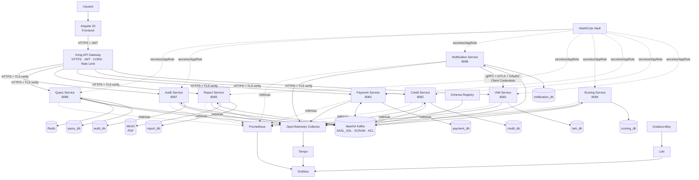

### Lectura del diagrama

```text
Usuario
   ↓
Angular
   ↓ HTTPS + JWT
Kong
   ↓
Microservicios
   ↓
Kafka como backbone asíncrono
   ↓
Database per Service
```

Además:

```text
Report Service       → MinIO
Query Service        → Redis
Notification Service → IAM mediante gRPC + mTLS + OAuth2
Todos los servicios  → Observabilidad
Todos los servicios  → Vault para secretos
```

---

# 36. Diagrama de Secuencia — Autenticación

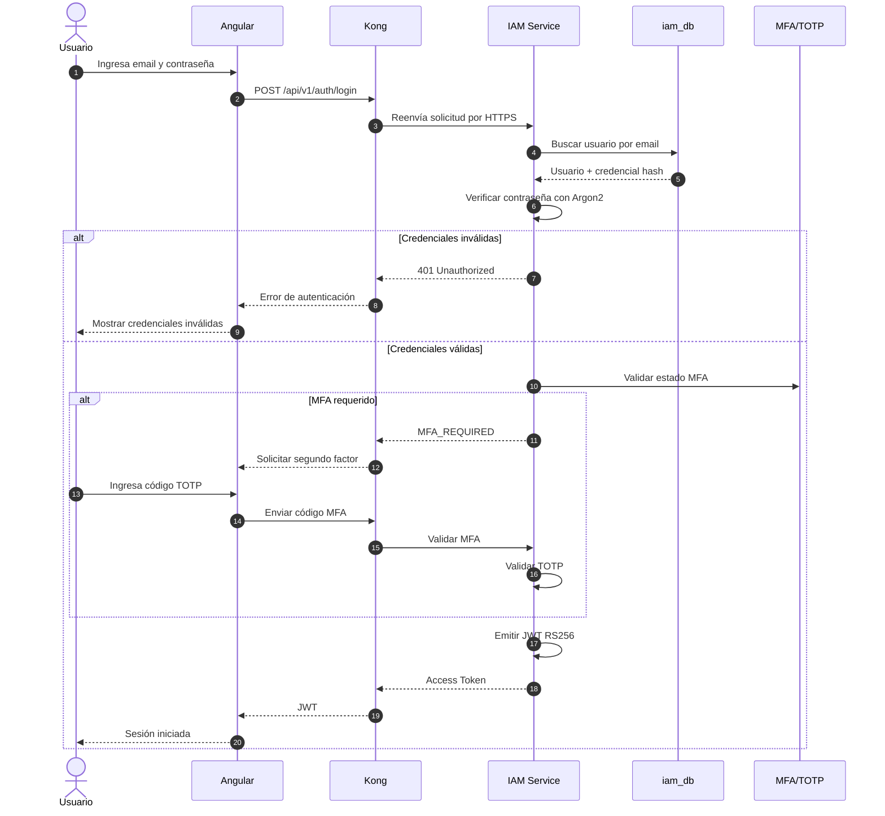

## Uso posterior del JWT

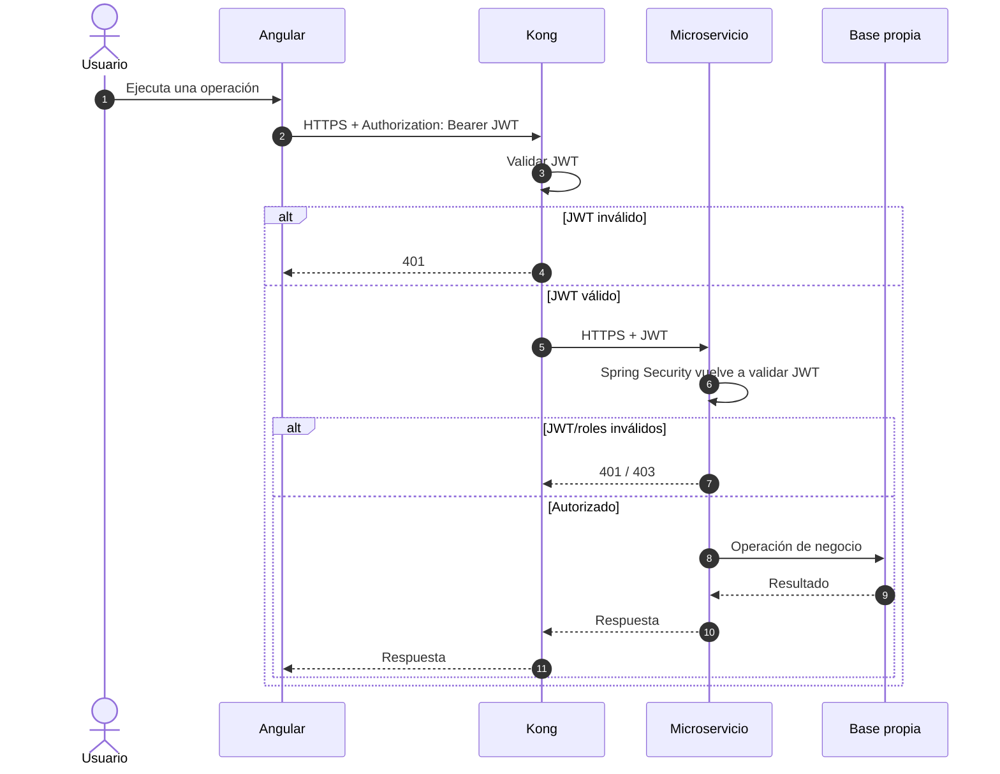

Esto representa la defensa en profundidad:

```text
Kong valida el token en el perímetro
            +
Spring Security lo vuelve a validar dentro del microservicio
```

---

# 37. Diagrama de Secuencia — Flujo principal de Scoring

Este es el flujo distribuido principal del sistema.

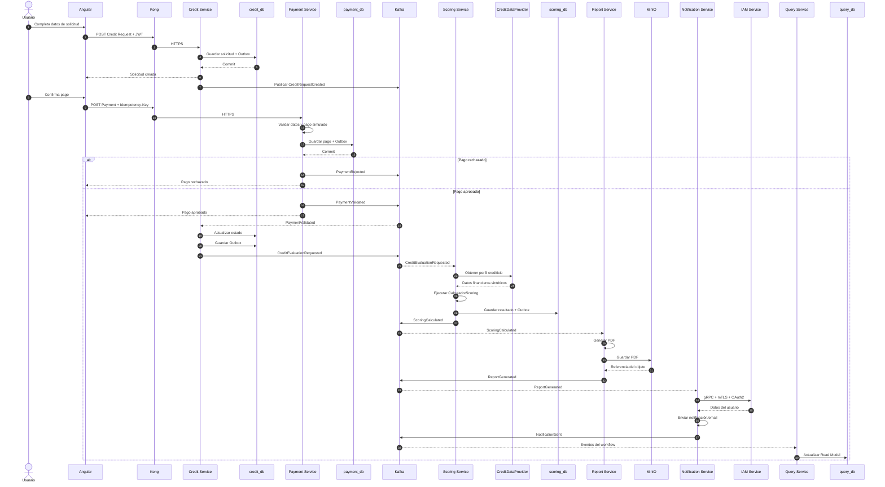

## Idea principal

```text
Credit
   ↓
Kafka
   ↓
Payment
   ↓
Kafka
   ↓
Scoring
   ↓
Kafka
   ↓
Report
   ↓
Kafka
   ↓
Notification
```

No existe un orquestador central.

Cada servicio:

```text
consume
  ↓
procesa
  ↓
persiste
  ↓
publica el siguiente evento
```

Esto implementa una **Saga por coreografía**.

---

# 38. Diagrama de Secuencia — Transactional Outbox

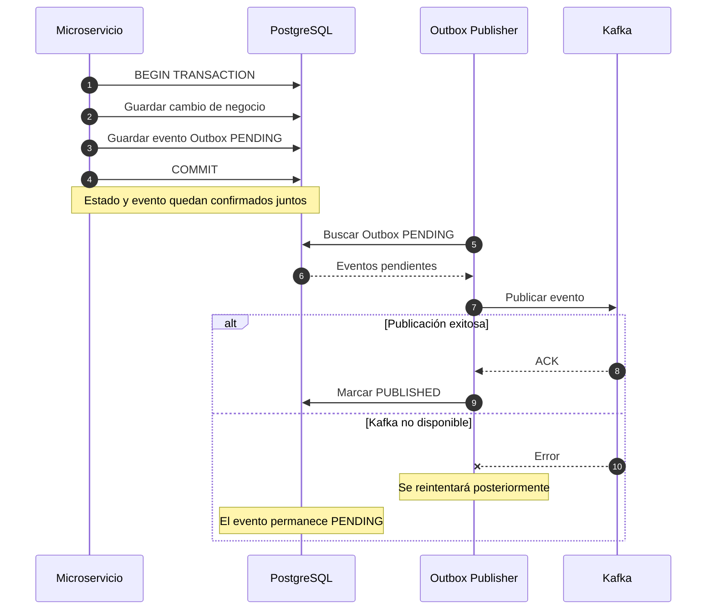

Esto evita:

```text
BD confirmada + evento Kafka perdido
```

---

# 39. Diagrama de Secuencia — Idempotent Consumer

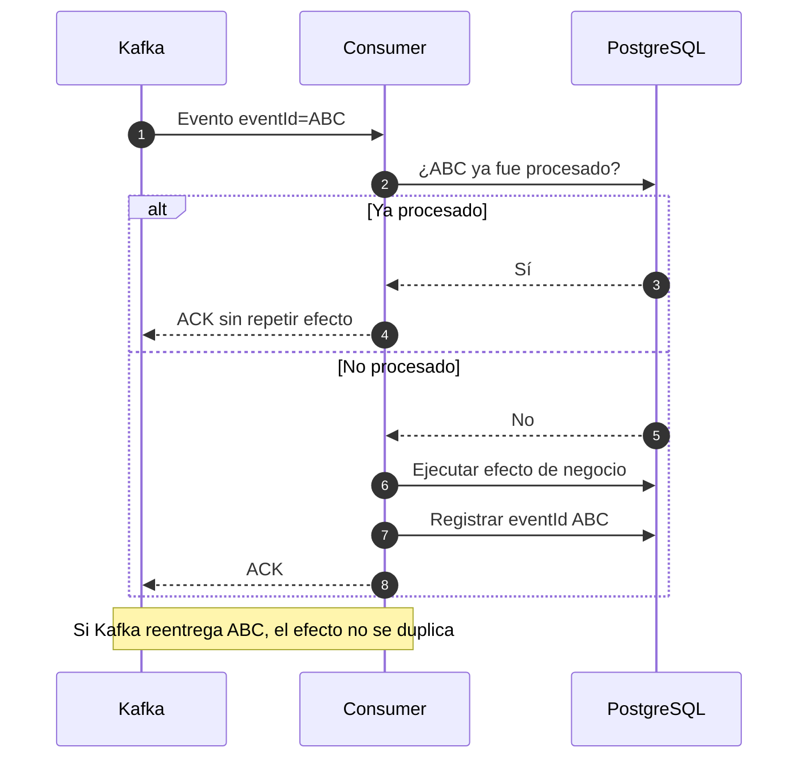

---

# 40. Diagrama de Secuencia — Mis Solicitudes / CQRS + Redis

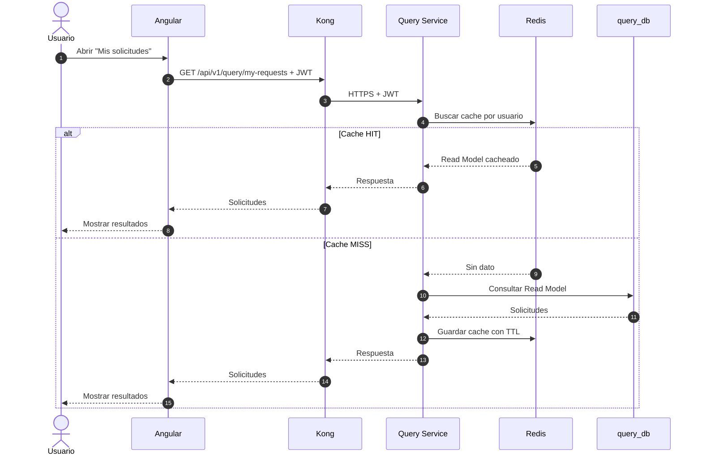

## Si Redis falla

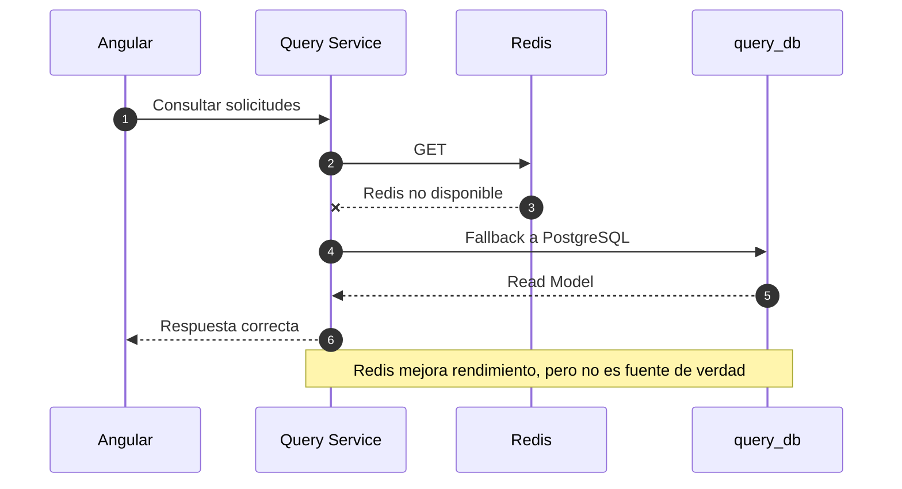

---

# 41. Diagrama de Secuencia — Notification → IAM por gRPC seguro

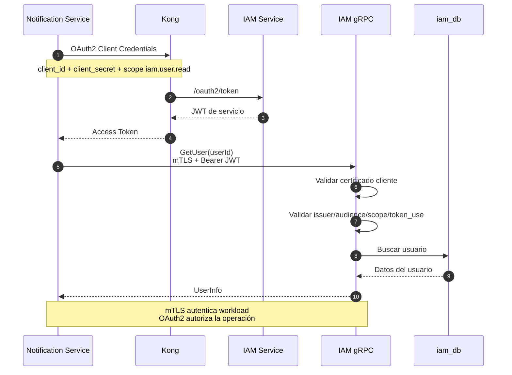

---

# 42. Diagrama de Secuencia — Resiliencia gRPC

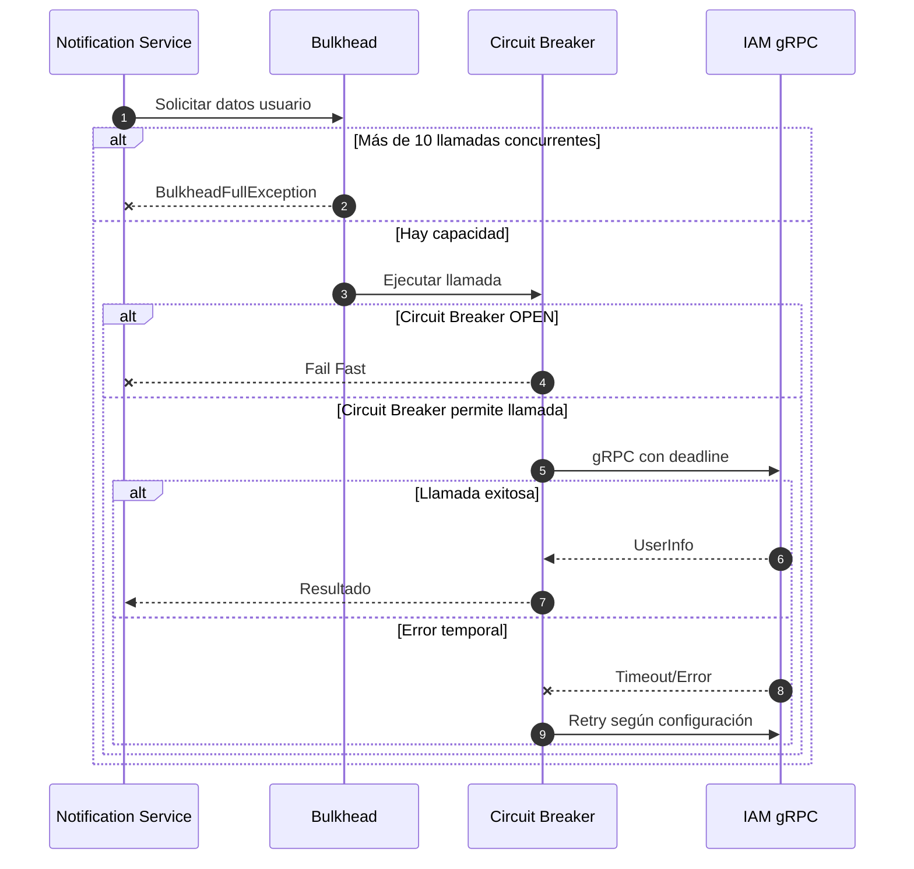

Funciones:

```text
Bulkhead       → limita concurrencia
CircuitBreaker → evita golpear repetidamente una dependencia caída
Retry          → reintenta errores temporales
Timeout        → evita esperas indefinidas
```

---

# 43. Diagrama de Secuencia — Retry y Dead Letter Topic

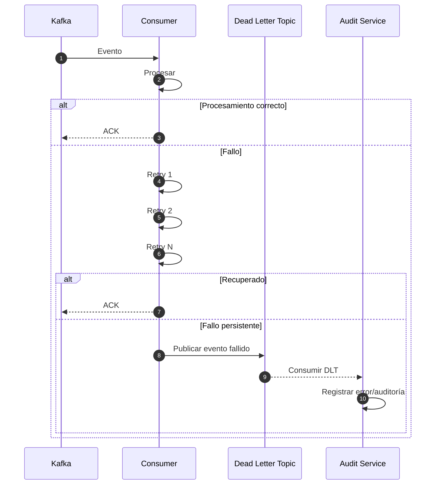

La DLT evita que un evento defectuoso bloquee indefinidamente el procesamiento normal.

---

# 44. Diagrama de Observabilidad

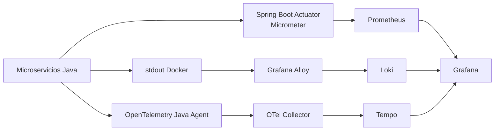

Los tres pilares:

```text
Métricas → Prometheus
Logs     → Loki
Trazas   → Tempo
                ↓
             Grafana
```

---

# 45. Vista resumida para exposición

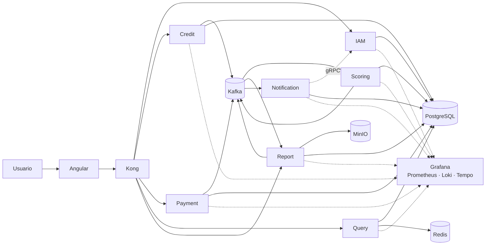

### Explicación corta

> Angular se comunica con Kong por HTTPS. Kong aplica seguridad, JWT, CORS, rate limiting y routing. Los microservicios mantienen sus propias bases de datos. Kafka coordina el workflow distribuido mediante eventos y Saga por coreografía. Payment, Credit, Scoring, Report y Notification se desacoplan mediante Kafka. Report almacena el PDF en MinIO. Query Service construye el modelo de lectura y utiliza Redis como cache. Notification consulta IAM mediante gRPC protegido por mTLS y OAuth2 Client Credentials. Vault administra los secretos y la observabilidad se implementa con Prometheus, Loki, Tempo, OpenTelemetry y Grafana.

